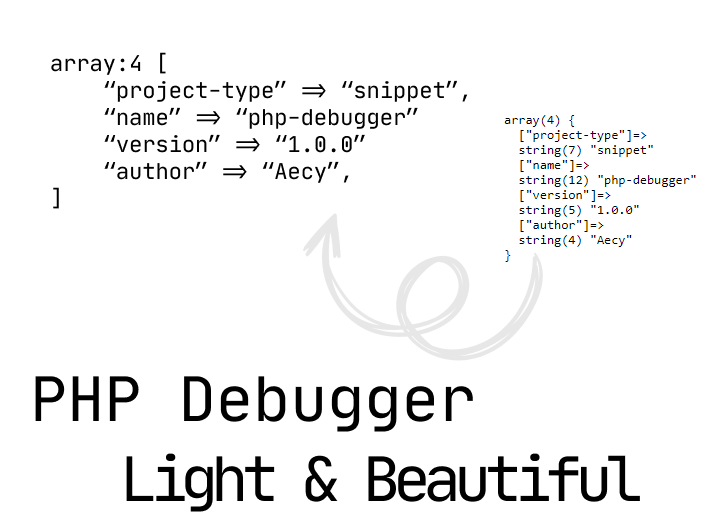

<p align="center">
    
</p>

---

This PHP snippet provides a simple, elegant way to debug and display the contents of variables, arrays, and objects in a human-readable format. It highlights the data with custom styling, making it easier to analyze complex structures in your application.

## Features
- **Array and Object Dumping:** Displays arrays and objects with proper indentation and formatting.
- **Custom Styling:** Includes custom CSS for better visibility of different data types.
- **Support for Various Data Types:** Supports strings, integers, floats, booleans, null values, arrays, and objects.
- **Syntax Highlighting:** Color-coded output for better readability.

## Installation
> Require [PHP 5.6+](https://www.php.net/releases/)

1. **Copy the Functions:**
   Copy the provided `highlight`, `dump`, and `dd` functions into your PHP project.
2. **Add CSS Styles:**
   The `dump` function includes internal CSS styles. You can customize these styles to fit your project’s design or remove them if you prefer to use external styles.
3. **Use the Functions:**
    - `dump($data)` – Outputs the formatted and highlighted data.
    - `dd($data)` – Outputs the formatted data and then stops the script execution.

## Example Usage

```php
<?php

$technologiesArray = ['TailwindCSS', 'AlpineJS','Livewire', 'Laravel'];
$courseArray = [
    'name' => 'TALL Stack Course',
    'price' => 14.99,
    'published' => true,
    'author' => null,
    'technologies' => $technologiesArray
];

class Course
{
    public $name = 'TALL Stack Course';
    public $price = 14.99;
    public $published = true;
    public $technologies = ['TailwindCSS', 'AlpineJS', 'Livewire', 'Laravel'];
}

$courseObject = new Course();

dump($courseArray);
dump($courseObject);
```

This will display the `$courseArray` and `$courseObject` in a visually appealing format with syntax highlighting.

## Results


## Functions

### `highlight($data, $tab = 1)`
- Recursively processes arrays and objects, generating a formatted string with HTML elements and appropriate indentations.
- **Parameters:**
  - `$data`: The data to be highlighted (can be an array, object, or any other type).
  - `$tab`: The indentation level for nested structures.

### `dump($data)`
- Outputs the highlighted data wrapped in a `<pre>` HTML tag with custom styling.
- **Parameters:**
  - `$data`: The data to be dumped.

### `dd($data)`
- Dumps the data and immediately halts further script execution.
- **Parameters:**
  - `$data`: The data to be dumped.

## Customization

You can adjust the styles in the `<style>` tag inside the `dump` function to match the visual aesthetics of your project. The colors for strings, numbers, booleans, and other types are customizable.

## License

PHP Debugger is an open-sourced snippet licensed under the [MIT License](https://opensource.org/license/MIT).

